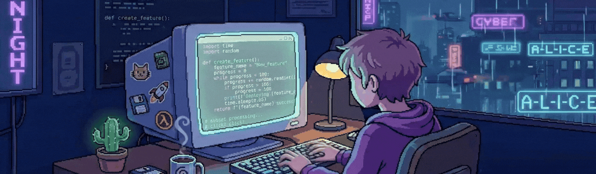

  

## 👋 Hi there

### Aspiring AI service engineer and web developer 💻 with a passion for building intelligent systems.

🌱 I’m currently learning:

- Machine learning fundamentals
- Natural language processing (NLP)
- AI system design and model architectures

## 🚀 Experience & Training

> 🤖 **NAVER Connect Foundation, boostcamp AI Tech 8th**  
> Sep 2025 – Feb 2026  
> Trainee | Intensive training program focused on AI model development, machine learning pipelines, and deployment of deep learning systems.
>
> 🌱 **Sparta Coding Club, Tomorrow Learning Camp – AI Track 9th**  
> Nov 2024 – Mar 2025  
> Trainee | Trained in Python, ML/DL fundamentals, and web development with Django/DRF; completed a capstone project implementing an AI service using LLM APIs.

## 📋 Projects & Research

| Project / Research                                                                                                                    | Period              | Description                                                                                                                             |
| ------------------------------------------------------------------------------------------------------------------------------------- | ------------------- | --------------------------------------------------------------------------------------------------------------------------------------- |
| [FanMate: AI Chatbot for KBO Team Recommendation and Fan Engagement](https://github.com/boostcampaitech8/pro-nlp-finalproject-nlp-16) | Jan 2026 – Feb 2026 | An AI chatbot service that helps new KBO fans discover the right team and feel connected through personalized conversations.            |
| [CSAT-Solver: CSAT-Style Question Solving Model](https://github.com/boostcampaitech8/pro-nlp-generationfornlp-nlp-16)                 | Dec 2025 – Jan 2026 | A project that explores how small and medium-sized LLMs can solve CSAT-style questions without relying on large-scale models.           |
| [ODQA: Open-Domain Question Answering System](https://github.com/boostcampaitech8/pro-nlp-mrc-nlp-16)                                 | Nov 2025 – Nov 2025 | A project focused on building an open-domain question answering system that retrieves relevant documents and extracts accurate answers. |
| [AINFO: Personalized Public Service Recommendation Chatbot](https://github.com/JaceJung-dev/AInfo-Backend)                            | Mar 2025 – Apr 2025 | LLM-based chatbot for personalized public service recommendations. Built with Django/DRF and deployed prototype.                        |

<!--
**JaceJung-dev/JaceJung-dev** is a ✨ _special_ ✨ repository because its `README.md` (this file) appears on your GitHub profile.

Here are some ideas to get you started:

- 🔭 I’m currently working on ...
- 🌱 I’m currently learning ...
- 👯 I’m looking to collaborate on ...
- 🤔 I’m looking for help with ...
- 💬 Ask me about ...
- 📫 How to reach me: ...
- 😄 Pronouns: ...
- ⚡ Fun fact: ...
-->
